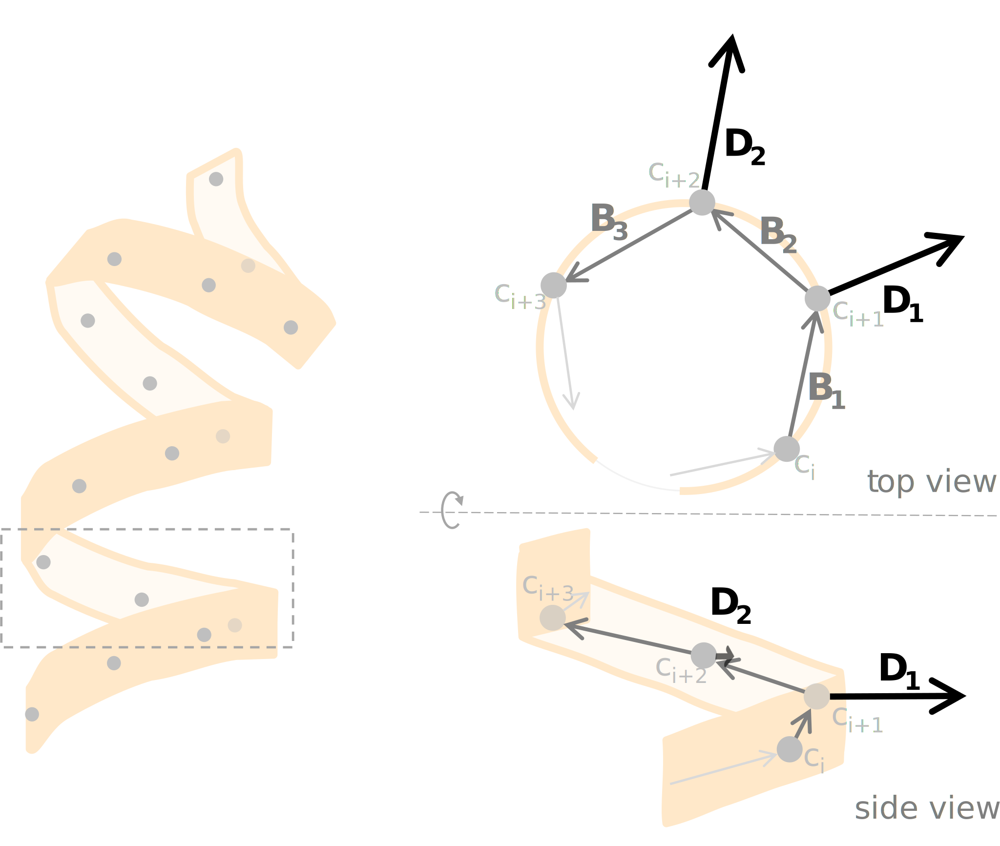

Computed Properties
===================

Helanal follows the procedure of Sugeta and Miyazawa [Sugeta1967]_. Properties
are computed for a 'window' of four consecutive :math:`C_α` atoms, and this 
window is then slid along the length of the helix in one-residue steps.

For each window consisting of atoms :math:`c_i`, :math:`c_{i+1}`, 
:math:`c_{i+2}`, :math:`c_{i+3}`, the vectors :math:`\mathbf{B_1}`, 
:math:`\mathbf{B_2}`, and :math:`\mathbf{B_3}` joining (respectively) atoms 
:math:`c_i` → :math:`c_{i+1}`, :math:`c_{i+1}` → :math:`c_{i+2}` and 
:math:`c_{i+2}` → :math:`c_{i+3}` are calculated, along with the vectors 
:math:`\mathbf{D_1} = \mathbf{B_1} - \mathbf{B_2}` and 
:math:`\mathbf{D_2} = \mathbf{B_2} - \mathbf{B_3}`. 

From these, the helix properties below are computed in each simulation frame.
These properties are available in ``.results`` as arrays, the shape of which
depends on the number of residues :math:`n_{res}` (and the property being 
calculated). **Note that each helix must contain at least 9 residues.**

If multiple helices are being analysed, the results are returned as lists (of
length :math:`n_{helices}`) of arrays of the indicated shape.

All angles are in degrees.

.. list-table::
   :widths: 40 30 20
   :header-rows: 1

   * - Description
     -  
     - Shape
   * - ``local_helix_directions``: the normalised vector :math:`\mathbf{D_1}` 
       (or :math:`\mathbf{D_2}`) for each atom :math:`c_{i+1}` (or 
       :math:`c_{i+2}`).

       Assuming ~even spacing of the atoms, this vector will bisect the angle 
       formed by (:math:`c_i,c_{i+1},c_{i+2}`), lie approximately in the plane
       perpendicular to the helix axis, and point from the projected local 
       helix centre to the atom :math:`c_{i+1}`.
     - .. image:: images/helix_directions.svg
          :width: 100%
     - :math:`(n_{frames}, n_{res}-2, 3)`
   * - ``local_twists``: the approximate 'twist' of the helix between atoms 
       :math:`c_{i+1}` and :math:`c_{i+2}`, calculated as the angle :math:`θ`
       between :math:`\mathbf{D_1}` and :math:`\mathbf{D_2}`.
     - .. image:: images/twists.svg
          :width: 100%
     - :math:`(n_{frames}, n_{res}-3)`
   * - ``local_nres_per_turn``: the number of residues that fit in one complete
       turn of the helix, based on `local_twist`.
     - 
     - :math:`(n_{frames}, n_{res}-3)`
   * - ``local_origins``: the projected centre of each 4-atom window, in line 
       with atom :math:`c_{i+1}`.
       
       Calculated as the approximate intersection of :math:`\mathbf{D_1}` and
       :math:`\mathbf{D_2}` projected on the perpendicular plane, assuming ~even
       spacing of atoms.
     - .. image:: images/origins.svg
          :width: 100%
     - :math:`(n_{frames}, n_{res}-2, 3)`
   * - ``local_axes``: the (normalised) central axis :math:`\mathbf{A}` of the 
       4-atom window, calculated as the normal to the two vectors 
       :math:`\mathbf{D_1}` and :math:`\mathbf{D_2}`. 
     - .. image:: images/axes.svg
          :width: 100%
     - :math:`(n_{frames}, n_{res}-3, 3)`
   * - ``local_heights``: the 'rise' :math:`h` of the helix (in the direction 
       of `local_axes`) between atoms :math:`c_{i+1}` and :math:`c_{i+2}`.
     - .. image:: images/heights.svg
          :width: 100%
     - :math:`(n_{frames}, n_{res}-3)`
   * - ``local_bends``: the angle of bending of the helix between adjacent 
       4-atom windows, i.e. the angle :math:`β` between the `local_axes` 
       :math:`\mathbf{A_i}` (of atoms :math:`c_i,c_{i+1},c_{i+2},c_{i+3}`) and 
       :math:`\mathbf{A_{i+3}` (of atoms 
       :math:`c_{i+3},c_{i+4},c_{i+5},c_{i+6}`).
     - .. image:: images/bends.svg
          :width: 100%
     - :math:`(n_{frames}, n_{res}-6)`
   * - ``all_bends``: pair-wise matrix of angles between all pairs of
       `local_axes`.
     - 
     - :math:`(n_{frames}, n_{res}-3, n_{res}-3)`
   * - ``global_axis``: the length-wise axis :math:`\mathbf{G}` for the overall
       helix, pointing from the end of the helix to the start. Calculated as the
       vector of best fit through all `local_origins`.
     - .. image:: images/global_axis.svg
          :width: 100%
     - :math:`(n_{frames}, 3)`
   * - ``global_tilts``: the angle :math:`γ` between the `global_axis` 
       :math:`\mathbf{G}` and the reference axis (specified by the ``ref_axis``
       option). If no axis is specified, the z-axis is used.
     - .. image:: images/global_tilts.svg
          :width: 100%
     - :math:`(n_{frames},)`
   * - ``local_screw_angles``: The cylindrical azimuthal angle :math:`α` of 
       atom :math:`c_{i+1}` (in the range -pi to pi). 

       This is measured as the angle between the `ref_axis` to the 
       `local_helix_directions` vector :math:`\mathbf{D}`, when both are 
       projected on a plane perpendicular to `global_axis`.
     - .. image:: images/screw_angles.svg
          :width: 100%
     - :math:`(n_{frames}, n_{res}-2)`

A summary of the results, including mean, sample standard deviation and mean 
absolute deviation is also provided in ``results.summary``.
